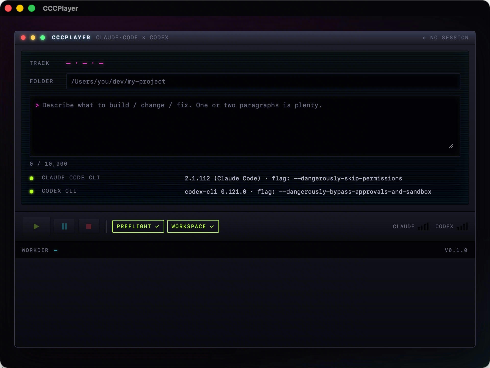
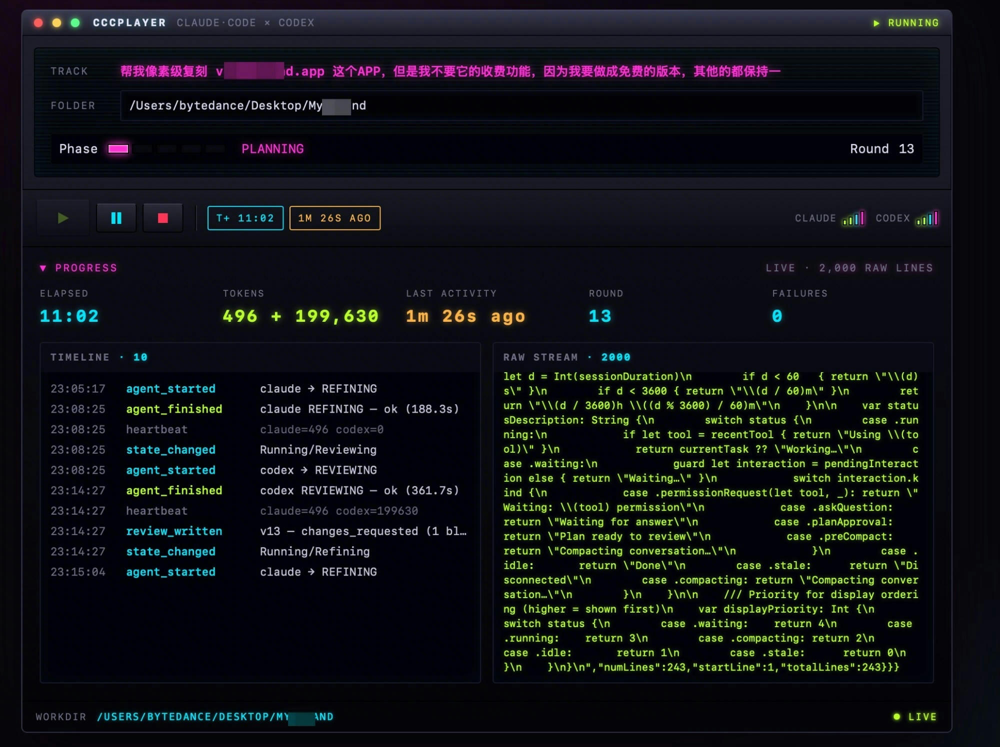
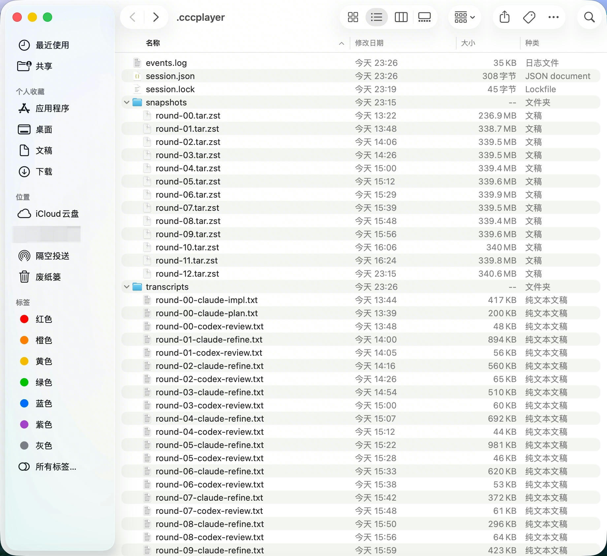

# CCCPlayer

> **Claude Code & Codex Player — burn compute, not your time.**
>
> A macOS desktop app that hands a local folder to two AI coding agents and
> walks away until the work is done. · 让两个 AI coding agent 接管本地目录，
> 按一次 Play 之后就别管了。



---

- [English](#english) · [中文说明](#中文说明)
- **Download / 下载**：[`dist/`](https://github.com/pekinlcc/CCCPlayer/tree/claude/macos-claude-code-client-Fhm6A/dist)
- **Source / 源码**：[github.com/pekinlcc/CCCPlayer](https://github.com/pekinlcc/CCCPlayer)

---

## English

### What's new in v1.2 (2026-04-18)

- **GOAL_CHECK now runs after every REVIEWING.** The Remaining-to-goal
  panel no longer stays stuck at "waiting for first goal check" for
  hundreds of rounds. Every review cycle launches both agents' goal
  checks in parallel and pushes fresh missing lists + rationale into
  the panel. DONE still gates on both independently saying `done=true`.
- **Resume button.** Once paused, the triangle Play button lights up as
  Resume so you can continue without losing session state.
- **Optimistic Pause / Stop feedback.** The title bar now shows
  `⏸ PAUSING…` / `■ STOPPING…` the instant you click, instead of
  pretending nothing happened for the 5–10s it takes the orchestrator
  to actually unwind the current turn.

### v1.1 recap

- Remaining-to-goal panel with dual-column (Claude / Codex) + agreement
  badge showing the DONE contract (both agents done=true).
- Per-agent labeled Tokens KV (`Claude N` / `Codex N`).
- Native `Browse…` folder picker.
- Fixed: title-bar status / phase display was frozen at initial value
  due to a CamelCase regex mismatch; Pause looked broken as a result.
- Event schema: `GoalCheck` carries full `missing[]` + `rationale`.

Full changelog: [`RELEASE_NOTES.md`](RELEASE_NOTES.md).

### What is this

Set a local folder + describe a goal in plain English (e.g. *"pixel-perfect
clone of some.app, but drop the paid features"*). Hit the ▶ play button.
CCCPlayer drives **Claude Code** and **Codex** on your machine in a loop —
Claude plans + implements, Codex reviews, they iterate over a shared `PRD.md`
and `codex_review_v{N}.md` until both agree the goal is met.

The name is a nod to Winamp: this is a *player* for two code agents.
Triangle ▶ Play, double-bar ⏸ Pause, square ■ Stop. Neon cyan / magenta / lime
on black chrome. Everything runs locally; the app itself makes zero network
calls. Your tokens, your code, your machine.

### Prerequisites

macOS 13+ with both CLIs installed and logged in **inside your Terminal**:

```sh
# Claude Code CLI (Anthropic)
# Install per https://docs.anthropic.com/en/docs/claude-code
claude --version

# Codex CLI (OpenAI, via npm)
npm i -g @openai/codex
codex --version
codex login
```

Tokens are billed to your Claude + Codex accounts — CCCPlayer is just the
harness, not a proxy.

### Download

Latest Apple Silicon build lives in [`dist/`](dist/):

| File | Size | Use |
| --- | --- | --- |
| [`CCCPlayer-1.2.0-arm64.dmg`](dist/CCCPlayer-1.2.0-arm64.dmg) | 5.3 MB | Double-click to mount, drag to `/Applications` |
| [`CCCPlayer-1.2.0-arm64.app.tar.gz`](dist/CCCPlayer-1.2.0-arm64.app.tar.gz) | 4.2 MB | Extract to get `.app` directly |

Apple Silicon only for now (M1/M2/M3/M4). Intel builds can be produced from
source (see *Build from source* below).

The `.app` is unsigned and unnotarized. On first launch macOS Gatekeeper will
block it; unblock with either:

```sh
# A. Right-click the .app → Open → confirm once.
# B. Strip quarantine in Terminal:
xattr -d com.apple.quarantine /Applications/CCCPlayer.app
```

### How to use

1. **Open CCCPlayer.app**. Top-right says `◇ NO SESSION` until you start one.
2. Fill **FOLDER** with a local path — empty dir or existing project, both
   work. CCCPlayer surveys existing code first and builds on top, never wipes.
   Home dir / system paths are rejected.
3. Type your goal in the terminal-style box. One or two short paragraphs.
4. Wait for both preflight rows to turn green (CLAUDE CODE CLI + CODEX CLI).
5. Click the lime **▶ Play** button in the bottom-left transport.
6. The UI switches to Running state:

    

   - Phase LEDs progress through `PLANNING → IMPLEMENTING → REVIEWING →
     REFINING → GOAL_CHECK`;
   - Progress panel shows live Elapsed · Tokens · Last activity · Round ·
     Failures (color-coded so you can glance from 20 feet away);
   - Left pane: structured Timeline (lime = ok, red = failed, amber = note);
   - Right pane: raw stdout/stderr from both CLIs, ring-buffered to 2000 lines.
7. **You can close the window and walk away.** Close ≠ quit — the session
   keeps running in the background. Use Cmd+Q to actually exit (it'll confirm).
8. When done: a result banner replaces the Progress panel with two buttons —
   **New session (same folder)** or **← Back to start**.

### What lives in your workdir

CCCPlayer stashes runtime state inside your workspace — auto-added to
`.gitignore` on session start:



```
your-workdir/
├── GOAL.md               immutable — your goal, agents can't edit
├── PRD.md                the shared product spec Claude writes
├── codex_review_v1.md    Codex's review (one per round)
├── codex_review_v2.md
├── …
└── .cccplayer/           runtime state (gitignored)
    ├── session.json      state machine · round counter · usage totals
    ├── events.log        JSONL event stream, append-only
    ├── transcripts/      per-turn stdout + stderr
    └── snapshots/        round-00…round-N tar.zst snapshots
```

`round-00.tar.zst` is your original code — never deleted, so you can roll back.

### Build from source

```sh
# Rust-only checks (no macOS deps needed):
cargo check --workspace
cargo test  --workspace

# Frontend
cd ui && npm install && npm run build && cd ..

# macOS .app bundle (must be on macOS — no cross-compile path):
./scripts/build-macos.sh --arch arm64    # Apple Silicon
./scripts/build-macos.sh --arch x86_64   # Intel
./scripts/build-macos.sh                 # Universal
./scripts/build-macos.sh --dev           # Hot-reload dev mode
```

Artifacts land in `target/<triple>/release/bundle/macos/CCCPlayer.app`.

### Architecture at a glance

```
crates/
├── core/       cccplayer-core      state machine · persistence · snapshots
├── harness/    cccplayer-harness   CLI runner · stall watcher · orchestrator
└── fake-cli/   cccplayer-fake-*    used by integration tests (no token burn)
app/
└── src-tauri/  Tauri desktop shell + IPC commands + icon
ui/             React + Vite frontend (Shell / Welcome / Running / Terminal)
prompts/        default agent prompt templates (embedded at build)
scripts/        build-macos.sh
dist/           latest macOS artifacts
docs/           screenshots
```

Full design in [`PRD.md`](PRD.md). Line-by-line conformance in
[`AUDIT.md`](AUDIT.md). Approved visual mockup
[`ui/mockups/cyberpunk-preview.html`](ui/mockups/cyberpunk-preview.html).

### Key engineering choices

- **Single-writer state machine** — every transition flows through
  `core::reducer::Reducer` behind one Tokio mutex; side-effects never write
  state back.
- **Harness owns the CLI** — `HarnessRunner` spawns each agent in a fresh
  process group (`setsid` + `kill_on_drop`), redacts stdout/stderr inline,
  and watches for stalls on `CLOCK_MONOTONIC` (lid-close doesn't trip it).
- **Two Tauri event channels** — `cccplayer://event` carries structured
  events; `cccplayer://raw` streams annotated stdout/stderr lines so you can
  diagnose CLIs that crash before producing structured output.
- **Claude 2.x adaptation** — `-p` + stream-json requires `--verbose`; usage
  parsing handles nested `assistant.message.usage`; goal-check JSON extracted
  from stream-json envelopes by pulling `.message.content[*].text`
  and `.result`.
- **Codex 0.1x adaptation** — invoked via `codex exec <prompt>`; token count
  scraped from its plain-text `tokens used\n<N>` tail.
- **Finder-launched PATH fix** — the app prepends Homebrew / nvm / volta /
  bun / cargo bin dirs to `PATH` at startup so `#!/usr/bin/env node` scripts
  (Codex) can find `node` even without a Terminal-inherited environment.
- **Zero telemetry** — no network calls from the app itself.

### Status

M1 scope (two-agent loop + macOS shell + cyberpunk UI) is shipped and
packaged. M2 is open: interactive 3-way merge for PRD conflicts, TCC
deep-links, full prompt-override settings page, multi-window sessions. See
[`AUDIT.md`](AUDIT.md) for row-by-row status.

### Contributing / Issues

This is a personal project — open a PR or file an Issue on GitHub.

---

## 中文说明

### v1.2 新增（2026-04-18）

- **每次 REVIEWING 完都跑 GOAL_CHECK**（之前要 Codex Approved 才跑，导致
  实测时 167 轮还一直「waiting for first goal check」）。现在每个 review
  cycle 尾部并行跑两个 agent 的 goal-check，Remaining 面板 2-10 分钟刷一次
  新鲜的「还差什么」。DONE 的判定不变——仍然是双方都 `done=true`。
- **Resume 按钮**。session 进 PAUSED 后，播放器的三角 Play 按钮重新亮起
  变 Resume，点击就从当前状态继续跑，不会丢 session。
- **Pause / Stop 点下去立刻有反馈**——标题栏瞬间切到 `⏸ PAUSING…` /
  `■ STOPPING…`，不再出现"点完 5-10 秒啥都不动"的错觉。

### v1.1 回顾

- Remaining-to-goal 面板双栏（Claude / Codex）+ agreement 徽章，把「DONE
  需要双方一致」的契约可视化。
- Tokens 按 agent 分行标注（`Claude N` / `Codex N`）。
- 原生 `Browse…` 目录选择器。
- 修复：state_changed CamelCase 正则 bug 导致 UI 状态永远不刷，Pause 看起来
  没反应其实是 session 早已 Errored。
- 事件 schema：`GoalCheck` 带全量 `missing[]` + `rationale`。

完整变更见 [`RELEASE_NOTES.md`](RELEASE_NOTES.md)。

### 这是什么

**CCCPlayer（Claude Code & Codex Player）**。叫「Player」是想到当年的 Winamp。
设定一个本地文件夹和你要达成的目标，比如「完全复刻某某 app 的功能，但去掉收费
模块」，你电脑上的 **Claude Code** 和 **Codex** 就会轮流干活并互相检查——
Claude 规划 + 实现，Codex 评审，两者通过共享的 `PRD.md` 和 `codex_review_v{N}.md`
反复迭代，直到双方都认为目标已达成。

一次 Play 按下去，然后就可以合盖去干别的。产品哲学是：**烧算力，不烧你的时间。**

### 使用前提

在你的 **macOS Terminal 内同时配置并登录** Claude Code 和 Codex CLI：

```sh
# Claude Code CLI（Anthropic 官方）
# 按 https://docs.anthropic.com/en/docs/claude-code 的指引安装
claude --version

# Codex CLI（OpenAI 官方，npm 安装）
npm i -g @openai/codex
codex --version
codex login
```

整个过程中 **完全使用你本人的 Claude Code 和 Codex 账户 + token**。CCCPlayer
本身不发任何网络请求，不是代理。

### 下载

最新 Apple Silicon 构建产物在 [`dist/`](dist/)：

| 文件 | 大小 | 用途 |
| --- | --- | --- |
| [`CCCPlayer-1.2.0-arm64.dmg`](dist/CCCPlayer-1.2.0-arm64.dmg) | 5.3 MB | 双击装；拖进 `/Applications` |
| [`CCCPlayer-1.2.0-arm64.app.tar.gz`](dist/CCCPlayer-1.2.0-arm64.app.tar.gz) | 4.2 MB | 解压即得 `.app` |

目前只有 Apple Silicon（M1/M2/M3/M4）版本。Intel 可以自己编（见下方「从源码编译」）。

未签名未公证，首次打开会被 Gatekeeper 拦，二选一解除：

```sh
# A. 右键 .app → 打开 → 再点一次"打开"
# B. 终端放行：
xattr -d com.apple.quarantine /Applications/CCCPlayer.app
```

### 怎么用

1. **双击打开 CCCPlayer.app**。初始化界面如下，右上角显示 `◇ NO SESSION`：

    

2. **FOLDER** 填工作目录（随便挑一个本地项目路径，已有代码或空目录都行——
   CCCPlayer 会先盘点现状再在上面增量，不会清空）。禁止家目录 `~` 或系统路径。
3. **Goal** 里用自然语言写你想让它做的事，一两段话足够：
    > 例：「帮我像素级复刻 vibeisland.app，但不要做收费模块，其他都保持一致。」
    > 例：「给这个项目加 CSV 导入并补完集成测试。」

4. 等底下两行 CLI 状态都变绿（CLAUDE CODE CLI ● + CODEX CLI ●）。
5. 点左下角绿色 **▶ Play**。客户端就调用你电脑上的 Claude Code 和 Codex 开始干活，
   过程中先由 Claude Code 规划和实现，Codex 来检查：

    

   - 上方 Phase LED 灯条按 `PLANNING → IMPLEMENTING → REVIEWING → REFINING →
     GOAL_CHECK` 推进；
   - Progress 面板实时显示 Elapsed（已耗时）/ Tokens（累计 token）/ Last activity
     （上次输出距今多久，超 60 秒会变黄警告可能卡住）/ Round（第几轮）/ Failures
     （失败计数）；
   - 左栏 Timeline 是结构化事件（ok 绿、失败红、note 琥珀）；
   - 右栏 Raw stream 是两个 CLI 的原始 stdout/stderr，环形缓冲 2000 行。

6. **可以关窗走人**。关窗 ≠ 退出——进程继续在后台跑。真要退出请 Cmd+Q（会弹确认）。
7. 结束时（DONE / STOPPED / ERRORED）Progress 面板会替换为结果横幅，两个按钮：
   **New session (same folder)** 保留目录重开、**← Back to start** 清空重来。

### 过程中的产物

Claude Code 和 Codex 的交流过程保存在工作目录下的隐藏文件夹 `.cccplayer/` 中
（session 创建时会自动加到 `.gitignore`）：


```
your-workdir/
├── GOAL.md               你的目标（被锁，agent 不许改）
├── PRD.md                Claude 写的产品需求文档（两 agent 的共识）
├── codex_review_v1.md    Codex 的评审（每 round 一个版本）
├── codex_review_v2.md
├── …
└── .cccplayer/           运行时私有（gitignored）
    ├── session.json      状态机当前态 / round 计数 / 累计 usage
    ├── events.log        结构化事件流 JSONL，append-only
    ├── transcripts/      每个 turn 的 stdout + stderr 归档
    └── snapshots/        round-00…round-N 的 tar.zst 快照，可回滚
```

`round-00.tar.zst` 是你**原始代码的完整备份**——永远不会被删，出错能回到起点。

### 从源码编译

```sh
# 纯 Rust 检查（不需要 macOS 原生依赖）
cargo check --workspace
cargo test  --workspace

# 前端打包
cd ui && npm install && npm run build && cd ..

# macOS .app 打包（必须在 Mac 上跑，没有 Linux→macOS 交叉编译路径）
./scripts/build-macos.sh --arch arm64    # Apple Silicon
./scripts/build-macos.sh --arch x86_64   # Intel
./scripts/build-macos.sh                 # Universal
./scripts/build-macos.sh --dev           # 开发热重载模式
```

产物在 `target/<triple>/release/bundle/macos/CCCPlayer.app`。

### 架构速览

```
crates/
├── core/        cccplayer-core      状态机 / 持久化 / 快照 / 脱敏
├── harness/     cccplayer-harness   CLI runner / stall watcher / orchestrator
└── fake-cli/    cccplayer-fake-*    集成测试用假 CLI（不烧 token）
app/
└── src-tauri/   Tauri desktop 壳 + IPC 命令 + 图标
ui/              React + Vite 前端（Shell / Welcome / Running / Terminal）
prompts/         默认 prompt 模板（编译期嵌入）
scripts/         build-macos.sh
dist/            最新 macOS 产物
docs/            截图等
```

详细设计见 [`PRD.md`](PRD.md)，实现细节的行级对照见 [`AUDIT.md`](AUDIT.md)。
UI 视觉原型图：[`ui/mockups/cyberpunk-preview.html`](ui/mockups/cyberpunk-preview.html)
（浏览器直接打开）。

### 关键工程决策（节选，完整版见 PRD §16 / §18）

- **单写者状态机**——所有状态跳转都经过 `core::reducer::Reducer`，一个 Tokio
  mutex 保护，side-effect 不回写 state。
- **harness 独占 CLI**——`HarnessRunner` 用 `setsid` + `kill_on_drop(true)` 在
  独立进程组里跑 agent，stdout/stderr 实时脱敏，stall watcher 走
  `CLOCK_MONOTONIC`（合盖不会误判卡死）。
- **Tauri 双事件通道**——`cccplayer://event` 结构化事件 + `cccplayer://raw`
  带 agent/phase 标注的原始流，UI 2000 行环形缓冲。
- **Claude 2.x 适配**——`-p` + stream-json 必须加 `--verbose`；usage 解析兼容
  嵌套 `assistant.message.usage`；goal-check JSON 从 stream-json 外壳里抽
  `.message.content[*].text` 与 `.result`。
- **Codex 0.1x 适配**——走 `codex exec <prompt>`；token 计数扫
  `tokens used\n<N>` 明文。
- **Finder 启动 PATH 注入**——app 启动时把 Homebrew / nvm / volta / bun / cargo
  的 bin 目录前插到 `PATH`，保证 `#!/usr/bin/env node` 的 CLI（Codex）也能找到
  `node`。
- **零遥测**——app 本身不发任何网络请求。

### 当前状态

M1 范围（双 agent 循环 + macOS 壳 + 赛博朋克 UI）已落地并打包。M2 未完成：
交互式三路合并、TCC 深链、完整 prompt 覆盖设置页、多窗口 session。逐条对照
见 [`AUDIT.md`](AUDIT.md)。

### 反馈 / 提 Issue

这是个人项目，欢迎直接开 PR 或在 GitHub 仓库里开 Issue。
